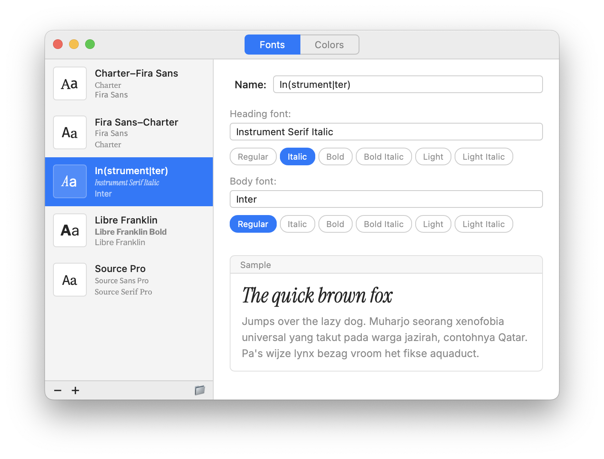
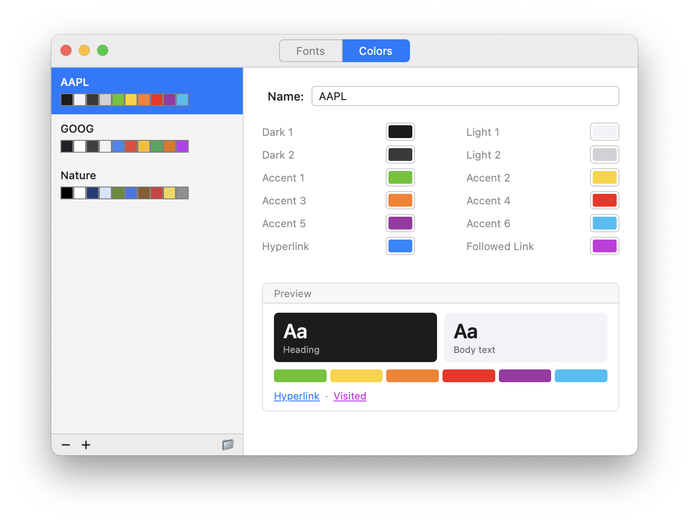

# Couturier


A small macOS utility for creating and editing Microsoft Office font and color themes. Vibe-coded using Claude.

<picture>
  <source media="(prefers-color-scheme: dark)" srcset="screenshots/fonts-dark.png">
  
</picture>
<picture>
  <source media="(prefers-color-scheme: dark)" srcset="screenshots/colors-dark.png">
  
</picture>

## What it does

Lists, previews, and edits the XML theme files that Office for Mac reads from your user content folder. Two editors are available via tabs:

**Font Themes** (`Theme Fonts/`) — Each theme sets a **heading font** and a **body font**, which appear in the theme font picker inside Word, Excel, and PowerPoint. Includes font variant pills (Regular, Bold, Italic, etc.) and a live sample preview that renders Office-private fonts correctly.

**Color Themes** (`Theme Colors/`) — Each theme defines 12 color slots: Dark 1 & 2, Light 1 & 2, six accent colors, Hyperlink, and Followed Link. A live preview shows how the colors look on dark and light slides.

Both editors support creating, renaming, and deleting themes. A "Reveal in Finder" button opens the relevant folder directly.

## Requirements

- macOS 11 (Big Sur) or later
- Microsoft Office for Mac installed (provides the Themes folder)
- [Rust](https://rustup.rs) + [Node.js](https://nodejs.org) v18+

## Dev setup

```sh
npm install
npm run dev     # builds and launches the app
npm run build   # produces a .app bundle in src-tauri/target/release/bundle
```

## Themes folder

Couturier auto-discovers the Themes folder on first launch using heuristics
(`User Content`, `Themes`, etc.). If it can't find it,
a banner appears letting you point to the correct folder manually. The chosen
path is saved to `~/Library/Application Support/com.couturier.app/config.json`.

The theme files live at paths like:

```
~/Library/Group Containers/UBF8T346G9.Office/User Content/Themes/Theme Fonts/
~/Library/Group Containers/UBF8T346G9.Office/User Content/Themes/Theme Colors/
```

## File format

**Font theme** (XML):

```xml
<?xml version="1.0" encoding="UTF-8" standalone="yes"?>
<a:fontScheme xmlns:a="http://schemas.openxmlformats.org/drawingml/2006/main" name="My Theme">
  <a:majorFont><a:latin typeface="Helvetica Neue"/></a:majorFont>
  <a:minorFont><a:latin typeface="Arial"/></a:minorFont>
</a:fontScheme>
```

**Color theme** (XML):

```xml
<?xml version="1.0" encoding="UTF-8" standalone="yes"?>
<a:clrScheme xmlns:a="http://schemas.openxmlformats.org/drawingml/2006/main" name="Nature">
  <a:dk1><a:srgbClr val="000000"/></a:dk1>
  <a:lt1><a:srgbClr val="FEFFFF"/></a:lt1>
  <a:dk2><a:srgbClr val="203E79"/></a:dk2>
  <a:lt2><a:srgbClr val="D3E5FF"/></a:lt2>
  <a:accent1><a:srgbClr val="5E8C30"/></a:accent1>
  <a:accent2><a:srgbClr val="3F76E3"/></a:accent2>
  <a:accent3><a:srgbClr val="8B592B"/></a:accent3>
  <a:accent4><a:srgbClr val="D23B3B"/></a:accent4>
  <a:accent5><a:srgbClr val="F2D64B"/></a:accent5>
  <a:accent6><a:srgbClr val="8F8F8F"/></a:accent6>
  <a:hlink><a:srgbClr val="3E75E4"/></a:hlink>
  <a:folHlink><a:srgbClr val="983EE4"/></a:folHlink>
</a:clrScheme>
```

## In the Future, Maybe

- Theme Effects editor (`Theme Effects/`)

## Attribution

App icon: [Europeana (@europeana) at Unsplash](https://unsplash.com/@europeana).
